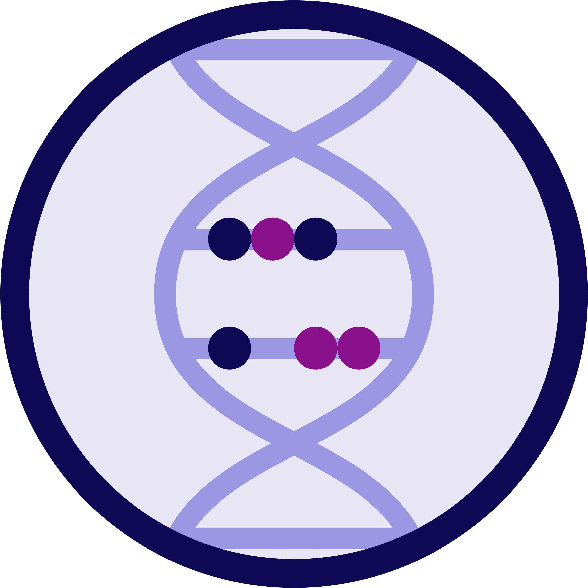

<h1 align="center">Abacus</h1>
<p align="center"><i>A tool for analyzing Short Tandem Repeats (STRs) from Long-Read Sequencing data</i></p>

<p align="center">
    
</p>

## Description

Abacus is a tool for analyzing STR (Short Tandem Repeat) data from Long-Read Sequencing technologies. It is designed to work with data from the Oxford Nanopore Technologies (ONT) platform, but has also been tested with data from the Pacific Biosciences (PacBio) platform. The main goal of Abacus is to provide a user-friendly interface for analyzing STR data and to provide a comprehensive report of the analysis results.

Abacus works by first converting the entries of an STR catalog (JSON) into graphs, which are then used to analyze the reads from an aligned BAM file. Each read in the BAM file is first mapped to the graph using [minigraph](https://github.com/lh3/minigraph), and the number of repeats of each satellite is calculated based on the resulting path. The reads are then grouped according to the satellite repeat counts, and the STR alleles (haplotypes) are called based on these groups. The analysis results are then saved in an HTML report file, which contains information about the STR loci, the called STR alleles, and visualizations of the data.

## Installation
To set up the environment for this project, follow these steps:

1. Clone the repository:
    ```sh
    git clone https://github.com/MOMA-AUH/abacus
    cd abacus
    ```

2. Create and activate the conda environment using the provided `env.yml` file:
    ```sh
    conda env create -f env.yml -n abacus
    conda activate abacus
    ```

3. Install Abacus using `pip`:
    ```sh
    pip install .
    ```

## Basic usage
To run Abacus, you need to provide the following arguments:

- `--bam`: The path to the BAM file that contains aligned reads from the Long-Read Sequencing data.
- `--ref`: The path to the reference FASTA file that was used to align the reads in the BAM file.
- `--str-catalog`: The path to the STR catalog (JSON) that contains the information about the STR loci that you want to analyze. See the [provided examples](./str_catalogs/) in the repository.
- `--report`: The path to the HTML file where the analysis results will be saved.
- `--vcf`: The path to the VCF file where the STR genotyping results will be saved.
- `--sample-id`: The identifier of the sample that you are analyzing.
- `--sex`: The sex of the sample (default: XX). Use `XX` for female and `XY` for male.
- `--loci-subset`: A subset of loci to process. Use multiple times to specify multiple loci.

### Example 1: Analyze all loci
```sh
abacus \
    --bam input.bam \
    --ref reference.fa \
    --str-catalog str_catalog.json \
    --report output.html \
    --vcf output.vcf \
    --sample-id my_sample
```

### Example 2: Analyze a subset of loci (FGF14 and RFC1) in male
```sh
abacus \
    --bam input.bam \
    --ref reference.fa \
    --str-catalog str_catalog.json \
    --report output.html \
    --vcf output.vcf \
    --sample-id my_sample \
    --sex XY \
    --loci-subset FGF14 \
    --loci-subset RFC1
```

### Configuration parameters
The following configuration parameters allow fine-tuning of the analysis:

#### Graph and Anchor Parameters
- `--anchor-length`: Length of the left and right anchor sequences. Default: `500`.
- `--min-anchor-overlap`: Minimum overlap between the read and the anchor sequence. Default: `200`.
- `--min-end-qual`: Minimum base quality at read ends. Used for trimming. Default: `17`.
- `--trim-window-size`: Window size for trimming low-quality bases. Default: `10`.
- `--max-trim`: Maximum number of bases to trim from the ends of reads. Default: `50`.

#### Quality Control Parameters
- `--min-str-qual`: Minimum mean base quality in the STR region. Reads with lower quality will be filtered out. Default: `20`.
- `--tol-str-qual`: Tolerance for mean base quality in the STR region. Default: `30`.
- `--min-q10-str-quality`: Minimum Q10 base quality in STR region. Default: `15`.
- `--tol-q10-str-quality`: Tolerance for Q10 base quality in STR region. Default: `30`.
- `--max-error-rate`: Maximum allowed error rate in the STR region. Reads with higher error rates will be filtered out. Default: `0.01`.
- `--tol-error-rate`: Tolerance for error rate in the STR region. Default: `0.005`.
- `--max-ref-divergence`: Maximum allowed reference divergence in the STR region. Default: `0.34`.
- `--min-n-outlier-detection`: Minimum number of reads required for outlier detection. Default: `10`.

#### Haplotype Parameters
- `--min-haplotyping-depth`: Minimum allowed depth for each called haplotype. If the depth is lower, the locus will be called as homozygous. Default: `10`.
- `--heterozygozity-alpha`: Sensitivity cutoff for the heterozygosity test. This test focuses on differences in length between haplotypes. Default: `0.05`.

#### Output Options
- `--log-file`: Path to the log file. Default: `abacus.log`.
- `--keep-temp-files`: Keep temporary files generated during analysis. Default: `False`.
- `--add-consensus-to-vcf`: Add consensus calls to the VCF output. Default: `False`.
- `--add-contracted-consensus-to-vcf`: Add contracted consensus calls to the VCF output. Default: `False`.

## The STR catalog

The STR catalog is a JSON file that contains information about the STR loci that you want to analyze. Each entry in the catalog should contain the following information:

- `LocusId`: The identifier of the STR locus. This can be any string that uniquely identifies the locus. It is used to refer to the locus in the analysis results.
- `LocusStructure`: The structure of the STR locus, where each repeat unit is enclosed in parentheses and followed by an asterisk. For example, the structure of the ATXN1 locus: `(CTG)*`. The structure can contain any number of repeat units of any length and can contain [IUPAC](https://en.wikipedia.org/wiki/International_Union_of_Pure_and_Applied_Chemistry) base symbols, such as `N` or `Y`. The structure can also contain non-repeating sequences, such as flanking regions or interruptions. For example, the structure of the HTT locus: `(CAG)*CAACAG(CCG)*`, where `CAACAG` is a non-repeating sequence.
- `ReferenceRegion`: The genomic region of the STR locus in the reference genome. This can be a single region of the entire structure of the STR locus, or a list of regions that cover the entire structure of the STR locus. The regions should be in the format `chr:start-end`, where `chr` is the chromosome name and `start` and `end` are the start and end positions of the region, respectively.

In `str_catalogs/moma_repeat_variants_catalog_240521.json` you can find a comprehensive list of STRs that are known to be variable in the human genome, which can be used as a starting point for your analysis. You can also create your own STR catalog by following the format described above. Underneath is an example of the structure of the STR catalog:

```json
[
    {
        "LocusId": "ATXN1",
        "LocusStructure": "(CTG)*",
        "ReferenceRegion": "chr6:16327635-16327722"
    },
    {
        "LocusId": "HTT",
        "LocusStructure": "(CAG)*CAACAG(CCG)*",
        "ReferenceRegion": [
            "chr4:3074876-3074933",
            "chr4:3074939-3074966"
        ]
    }
]
```

## Notes on FGF14
FGF14 is a complex locus with multiple haplotypes and a large number of variants. In the provided catalog [provided examples](./str_catalogs/abacus_catalog.json) we have included a `FGF14_complex` entry that contains the following information:

```json
[
    {
        "LocusId": "FGF14_complex",
        "LocusStructure": "(TAGTCATAGTACCCCAA)*(GAA)*",
        "ReferenceRegion": "chr13:102161565-102161726"
    },
]
```

The insertion `(TAGTCATAGTACCCCAA)*` is described in the following paper:
https://www.nature.com/articles/s41588-024-01808-5/figures/1

A lot of additional variation around the FGF14 locus is discussed in the following paper:
https://www.nature.com/articles/s41467-024-52148-1